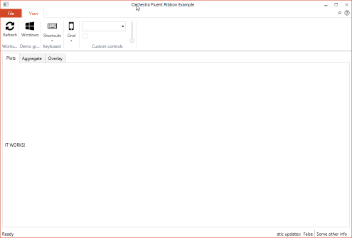
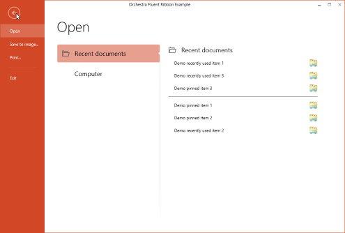
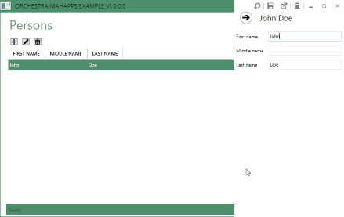

# Orchestra

Orchestra is a composable shell built on top of [Catel](http://www.catelproject.com).

Orchestra consists of a main shell including an SDK with services that allows developers to communicate with the shell. Developers can write their own modules which implement the actual functionality of their application.

These modules can communicate with the shell, but also with each other through the services that are offered out of the box.
 
# Shells

Orchestra provides support for a lot of different shells.

## Fluent Ribbon shell

 
 
## MahApps shell

# More information

Please check [LogViewer](https://github.com/WildGums/LogViewer), for an example on how to build an application with Orchestra.

## Update 2015/04/16

Some of the features which will come out of the box:

- [x] [MahApps](http://mahapps.com/) integration
- [ ] Module management (Nearly there with [Orc.NuGetExplorer](https://github.com/WildGums/Orc.NuGetExplorer))
- [x] License management => [Orc.LicenseManager](https://github.com/Orcomp/Orc.LicenseManager)
- [x] Command management
- [x] Shortcut manager (which will allow end users to remap shortcut keys)
- [x] Splash screen customization
- [x] About box window
- [x] Automatic updates => [Orc.Squirrel](https://github.com/Orcomp/Orc.Squirrel)

Features already included in [Catel](https://catelproject.atlassian.net/wiki/display/CTL/Catel+documentation+Home):
- [x] Application wide logging
- [x] FluentValidation
- [x] Memento (undo/redo)

Other Projects that might be of interest (And integrate easily with Orchestra):

- [Orc.ProjectManagement](https://github.com/Orcomp/Orc.ProjectManagement)
- [Orc.WorkspaceManagement](https://github.com/Orcomp/Orc.WorkspaceManagement)
- [Orc.LicenseManager](https://github.com/Orcomp/Orc.LicenseManager)
- [Orc.Squirrel](https://github.com/Orcomp/Orc.Squirrel) (Automatic Updates)
- [Orc.FilterBuilder](https://github.com/Orcomp/Orc.FilterBuilder)
- [Orc.Controls](https://github.com/Orcomp/Orc.Controls)
- [Orc.Search](https://github.com/WildGums/Orc.Search)
- [Orc.Feedback](https://github.com/WildGums/Orc.Feedback)
- [Orc.SystemInfo](https://github.com/WildGums/Orc.SystemInfo)
- [Orc.CrashReporting](https://github.com/WildGums/Orc.CrashReporting)
- [Orc.Notifications](https://github.com/WildGums/Orc.Notifications)
- [Orc.NuGetExplorer](https://github.com/WildGums/Orc.NuGetExplorer)

## License

MIT License

## Benefits to users:

- Framework developed with best practices in mind which will allow you to deploy robust applications
- Allows you to focus on the business logic so your application will be completed a lot sooner
- Built on [Catel](http://www.catelproject.com) and all that goes with it giving you a head start on your project
- Nuget packages released regularly:
    - [Orchestra.Library](http://nuget.org/packages/Orchestra.Library)
    - [Orchestra.Shell](http://nuget.org/packages/Orchestra.Shell)
- Visual Studio templates to get started quickly

## Plugin architecture

Orchestra uses a plugin architecture with some already well know open source libraries already implemented:

- [Catel](http://www.catelproject.com) (MVVM framework plus a lot more)
- [Fluent Ribbon](http://fluent.codeplex.com/)
- [Prism](http://compositewpf.codeplex.com/)
- [Nancy](http://www.nancyfx.org) (Lightweight Web Framework for .NET)
- [OxyPlot](http://oxyplot.codeplex.com/) (Cross platform plotting library - Work in progress)

It is easy to add extra modules by following the examples.

## Roadmap

- Automatic plugin update infrastructure

## Support

Please create an issue.

## Contribute

Everyone is encouraged to contribute, either by:

- Submitting pull requests
- Documentation
- Blogs and tutorials

## Other similar projects

- [Gemini](https://github.com/tgjones/gemini "Gemini")
- [Wide](https://github.com/chandramouleswaran/Wide/ "Wide")
- [Albatross Shell](https://albatrossshell.codeplex.com/ "Albatross Shell")

