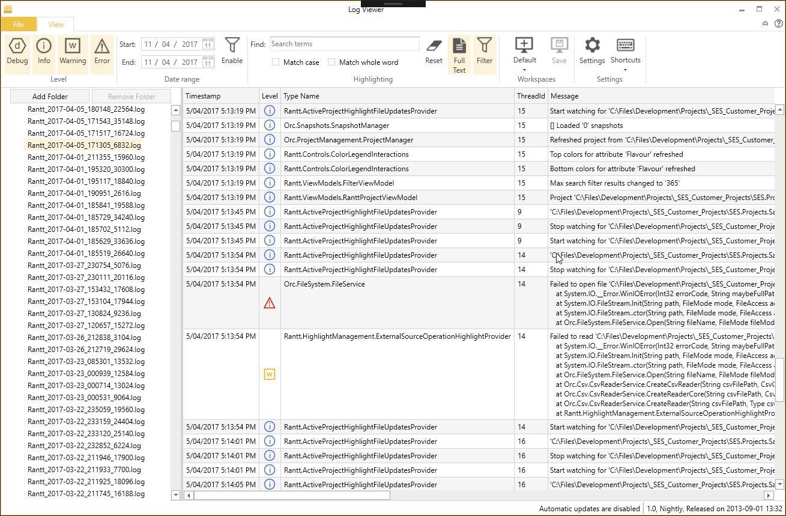
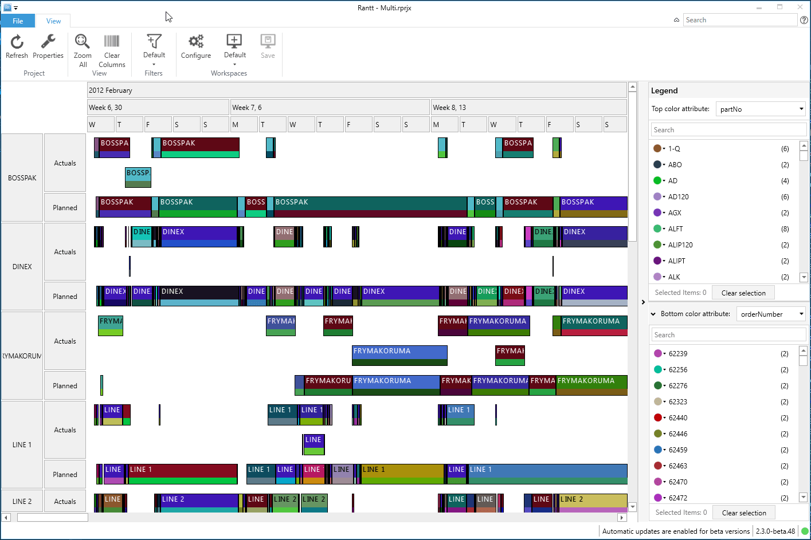
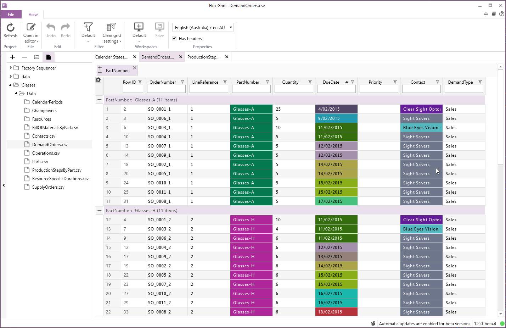

# Orchestra

Orchestra is a composable WPF shell and framework built on top of [Catel](http://www.catelproject.com).

It has been in active development for over 4 years (initial commit 2012/06/18) and is used in numerous Line of Business (LOB) applications on a daily basis.

Orchestra consists of a main shell including an SDK with services that allow developers to communicate with the shell.

## Goals

Provide a robust yet flexible LOB shell, designed with best practices in mind, to jump start the development of desktop applications.

In other words, we wanted to create a shell that dramatically speeds up the time it takes to release a LOB application to market by enabling developers to concentrate more on the business logic and less on scaffolding.

## Available Shells

Orchestra provides support for two different shells:

- Fluent ribbon
- MahApps

|  Fluent ribbon shell                                       | MahApps shell                                   |
|------------------------------------------------------------|-------------------------------------------------|
|   |   |
|   |                                                 |

## Release cycle

- Stable: every 2 to 3 months ('master' branch).
- Prerelease: daily/weekly as required ('develop' branch).

## Nuget packages

- [Orchestra.Core](https://www.nuget.org/packages/Orchestra.Core)
- [Orchestra.Shell.Ribbon.Fluent](https://www.nuget.org/packages/Orchestra.Shell.Ribbon.Fluent)
- [Orchestra.Shell.MahApps](https://www.nuget.org/packages/Orchestra.Shell.MahApp)

## Prerequisites

A good working knowledge of Inversion of Control (IoC).

## Orchestra features

- Application wide logging with an in app log viewer (CTRL + L)
- Command manager
- Shortcut key manager
- Fluent validation
- Themeable 'about box' window
- Themeable splash screen
- Consistent styling across the whole application

## Orchestra + module features

We purposely designed Orchestra to be a lightweight shell. However you can 'super charge' it with the following open source libraries:
(We use all these libraries with Orchestra. In fact they were designed to work seamlessly with Orchestra. Hint: the libraries all start with Orc.*)

- License management ([Orc.LicenseManager](https://github.com/Orcomp/Orc.LicenseManager))
- Project management ([Orc.ProjectManagement](https://github.com/Orcomp/Orc.ProjectManagement))
- Automatic updates ([Orc.NuGetExplorer](https://github.com/WildGums/Orc.NuGetExplorer) [Orc.Squirrel](https://github.com/Orcomp/Orc.Squirrel))
- Undo/Redo ([Orc.Memento](https://github.com/WildGums/Orc.Memento))

## Orchestra libraries

Here is a list of the major libraries that link back to their respective Github repositories:

- [Orc.Controls](https://github.com/Orcomp/Orc.Controls)
- [Orc.CrashReporting](https://github.com/WildGums/Orc.CrashReporting)
- [Orc.Feedback](https://github.com/WildGums/Orc.Feedback)
- [Orc.FilterBuilder](https://github.com/Orcomp/Orc.FilterBuilder)
- [Orc.LicenseManager](https://github.com/Orcomp/Orc.LicenseManager)
- [Orc.Memento](https://github.com/WildGums/Orc.Memento)
- [Orc.Notifications](https://github.com/WildGums/Orc.Notifications)
- [Orc.NuGetExplorer](https://github.com/WildGums/Orc.NuGetExplorer)
- [Orc.ProjectManagement](https://github.com/Orcomp/Orc.ProjectManagement)
- [Orc.Search](https://github.com/WildGums/Orc.Search)
- [Orc.Squirrel](https://github.com/Orcomp/Orc.Squirrel)
- [Orc.SystemInfo](https://github.com/WildGums/Orc.SystemInfo)
- [Orc.WorkspaceManagement](https://github.com/Orcomp/Orc.WorkspaceManagement)

You can find the full list [here](https://github.com/WildGums).

## Example Applications

Here are some examples of applications built with Orchestra and other Orc.* libraries:

| [LogViewer](https://github.com/WildGums/LogViewer)                                | Rantt                   | [CsvTextEditor](https://github.com/WildGums/CsvTextEditor) | FlexGrid    |
|:-:                                                                                |:-:                      |:-:                                                         |:-:          |
|Log viewer   | Gantt chart application | Csv file text editor                                       | Data visualizer            |
|                                             |    |    |   |
|   |   |   |   |

[LogViewer](https://github.com/WildGums/LogViewer) and [CsvTextEditor](https://github.com/WildGums/CsvTextEditor) are open source projects hosted on Github. 

## Contributions

Please feel free to contribute, either by:

- Reporting any issues
- Submitting pull requests
- Documentation
- Blogs and tutorials

## Services and Consulting

If you need help building a new desktop application (whether for internal use within your organization or to release to the public)
or need to setup a complete dev ops environment (which will allow you to commit your code and have an new version of your plugin ready for consumption within minutes and automatically applied to your application), please send us an email: contact@wildgums.com

It took us a lot of time to get this right. What initially seems like a simple and quick task can end up taking months, so benefit from our experience and save yourself a lot of time and money by letting us show you how to release a desktop application within weeks.

## License

MIT License

## Other similar open source projects

- [Gemini](https://github.com/tgjones/gemini "Gemini")
- [Wide](https://github.com/chandramouleswaran/Wide/ "Wide")
- [Albatross Shell](https://albatrossshell.codeplex.com/ "Albatross Shell")
