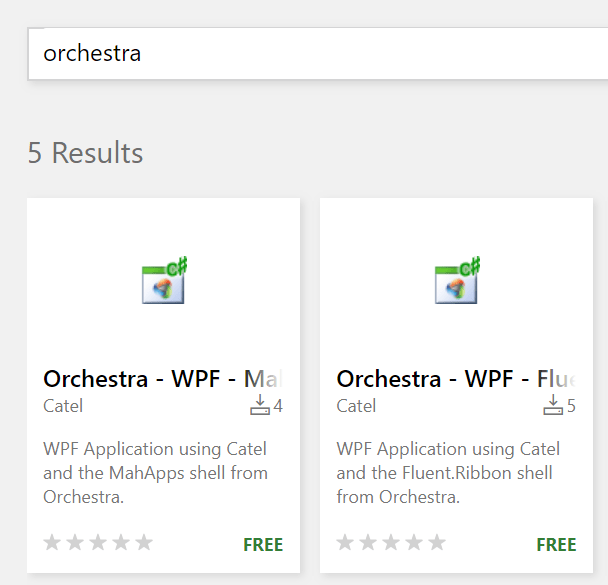
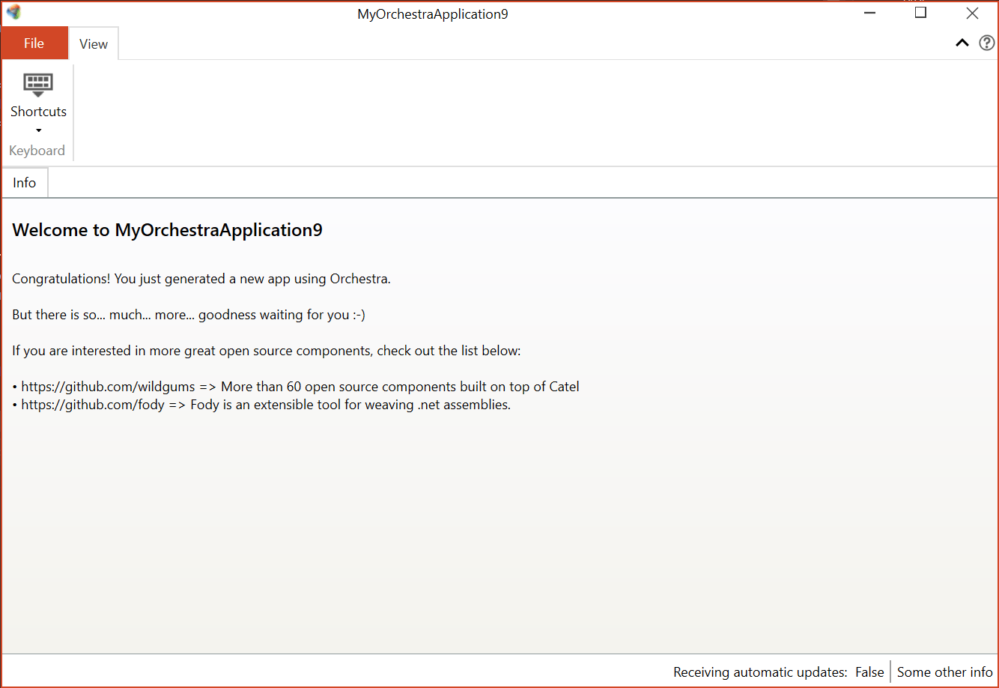
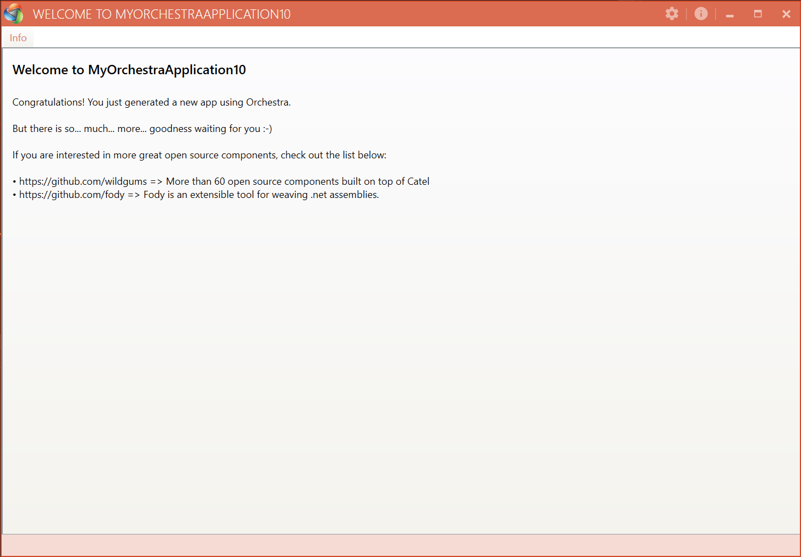

Orchestra
=========

Name|Badge
---|---
Chat|
Downloads|
Stable version|
Unstable version|
Open Collective| 

Orchestra is a mature, composable WPF shell and framework built on top of [Catel](http://www.catelproject.com).

It has been in active development for over 5 years (initial commit 2012/06/18) and is used in numerous Line of Business (LoB) applications on a daily basis.

Orchestra consists of a main shell including an SDK with services that allow developers to communicate with the shell.

## Goals

Provide a robust yet flexible LOB shell, designed with best practices in mind, to jump start the development of desktop applications.

In other words, we wanted to create a shell that dramatically speeds up the time it takes to release a LOB application to market by enabling developers to concentrate more on the business logic and less on scaffolding.

## Available Shells

Orchestra provides support for two different shells:

- Fluent ribbon
- MahApps

|  Fluent ribbon shell                                       | MahApps shell                                   |
|------------------------------------------------------------|-------------------------------------------------|
|   |   |
|   |                                                 |

## Project Templates

Want to get up and running fast? Grab the project templates from the [Visual Studio Marketplace](https://marketplace.visualstudio.com/search?term=orchestra&target=VS&category=All%20categories&vsVersion=&sortBy=Relevance):

You can pick either the Fluent.Ribbon or MahApps shell and have a fully running project within seconds:

## Sample Applications

Here are some examples of applications built with Orchestra and other Orc.* libraries:

| [LogViewer](https://github.com/WildGums/LogViewer)                                | Rantt                   | [CsvTextEditor](https://github.com/WildGums/CsvTextEditor) | FlexGrid    |
|:-:                                                                                |:-:                      |:-:                                                         |:-:          |
|Log viewer   | Gantt chart application | Csv file text editor                                       | Data visualizer            |
|                                             |    |    |   |
|   |   |   |   |

[LogViewer](https://github.com/WildGums/LogViewer) and [CsvTextEditor](https://github.com/WildGums/CsvTextEditor) are open source projects hosted on Github.

Other examples of commercial applications built with Orchestra can be found on our official website [WildGums.com](http://www.wildgums.com).

## NuGet packages

- [Orchestra.Core](https://www.nuget.org/packages/Orchestra.Core)
- [Orchestra.Shell.Ribbon.Fluent](https://www.nuget.org/packages/Orchestra.Shell.Ribbon.Fluent)
- [Orchestra.Shell.MahApps](https://www.nuget.org/packages/Orchestra.Shell.MahApp)

## Prerequisites

A good working knowledge of Inversion of Control (IoC).

## Orchestra features

- Application wide logging with an in app log viewer (CTRL + L)
- Command manager
- Shortcut key manager
- Fluent validation
- Themeable 'about box' window
- Themeable splash screen
- Consistent styling across the whole application

## Orchestra + module features

We purposely designed Orchestra to be a lightweight shell. However you can 'super charge' it with the following open source libraries:
(We use all these libraries with Orchestra. In fact they were designed to work seamlessly with Orchestra. Hint: the libraries all start with Orc.*)

- License management ([Orc.LicenseManager](https://github.com/Orcomp/Orc.LicenseManager))
- Project management ([Orc.ProjectManagement](https://github.com/Orcomp/Orc.ProjectManagement))
- Automatic updates ([Orc.NuGetExplorer](https://github.com/WildGums/Orc.NuGetExplorer) [Orc.Squirrel](https://github.com/Orcomp/Orc.Squirrel))
- Undo/Redo ([Orc.Memento](https://github.com/WildGums/Orc.Memento))

You can find the full list [here](https://github.com/WildGums).

## Other similar open source projects

- [Gemini](https://github.com/tgjones/gemini "Gemini")
- [Wide](https://github.com/chandramouleswaran/Wide/ "Wide")

For documentation, please visit the [documentation portal](https://opensource.wildgums.com)

## Backers

Thank you to all our backers! 🙏 [[Become a backer](https://opencollective.com/WildGums-oss#backer)]

## Sponsors

Support this project by becoming a sponsor. Your logo will show up here with a link to your website. [[Become a sponsor](https://opencollective.com/WildGums-oss#sponsor)]
