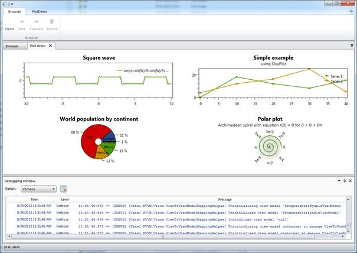
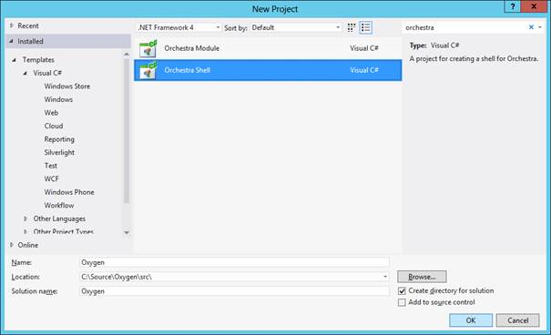
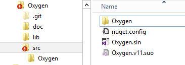
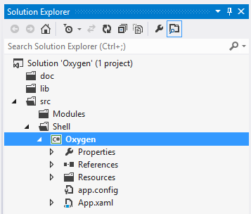
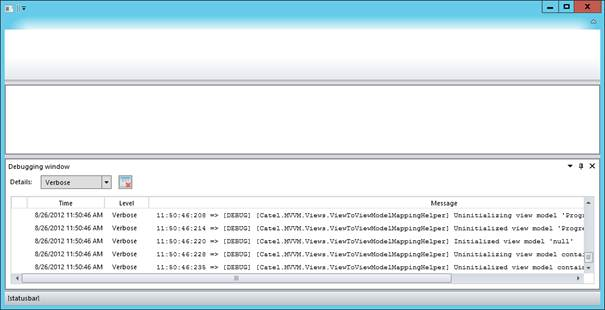

Introduction to Orchestra
-------------------------

Orchestra is a composable shell that allows developers to skip the
process of writing a custom framework for every application they have to
write. This way it is possible to focus on the actual business problem
that needs to be solved instead of writing a framework again and again.

The biggest advantage is that the core is maintained by open-source
developers so you will get improvements and new features by simply
updating to a new version.

Orchestra uses several well-known external libraries to make sure it can
provide the quality expected from such a framework:

-   AvalonDock (docking library)
-   Catel (MVVM framework)
-   FluentRibbon (ribbon)
-   Prism (modularity)

Orchestra consists of a main shell including an SDK with services that
allows developers to communicate with the shell. Developers can write
their own modules which implement the actual functionality of their
application. These modules can communicate with the shell, but also with
each other through the services that are offered out of the box.

 

External libraries explained
----------------------------

Orchestra uses several external libraries to extend its functionality.
Below is a table explaining each external framework and how they are
used inside Orchestra.

  -------------- ------------------------------------------------------------------------------------------------------------------------------------------------------------------------ -------------------------
  **Name**       **Usage**                                                                                                                                                                **Knowledge required?**

  AvalonDock     AvalonDock provides the tabbed interface and docking capabitilities of Orchestra.\                                                                                       
                 Orchestra fully takes care of the interaction with AvalonDock so no knowledge about AvalonDock is required.                                                              

  Catel          Catel provides the MVVM part of Orchestra. Since it is recommended to write all modules using MVVM, it is important to get a basic understanding of Catel.\              
                 A good way to start with Catel is to read the [official documentation](http://catel.catenalogic.com).                                                                    

  FluentRibbon   FluentRibbon provides the ribbon functionality of Orchestra.\                                                                                                            
                 Orchestra fully takes care of the interaction with FluentRibbon so no knowledge about FluentRibbon is required.                                                          

  Prism          Prism is used to provide the modularity of Orchestra. This means that each module is discovered by the prism bootstrapper that Orchestra initiates behind the scenes.\   
                 Orchestra fully takes care of the interaction with Prism so no knowledge about Prism is required.                                                                        
  -------------- ------------------------------------------------------------------------------------------------------------------------------------------------------------------------ -------------------------

 

Creating the shell
------------------

When using Orchestra, the first thing that needs to be done is to create
the shell. This will make sure that your application actually starts up
and can be extended.

*Note that this guide also includes some best practices, which are not
required but we strongly advise you to follow them*

*Note that project templates are available and this guide assumes that
they are installed on the machine*

#### Creating the project and solution

1.  Create a new Orchestra Shell application:\

2.  Make sure that your directory structure looks like this after you
    created the project and solution (move the files if you have to):\

3.  Open the solution again and make sure to create solution folders in
    the solution explorer. This will make sure that the application
    stays structured and easy to maintain:\
\
*Note that the solution directory don’t have to reflect the directories on disk*

#### Adding Orchestra using NuGet

*Note that as long as the packages are not available yet, this has to be
done manually*

Now the solution and the shell project are created, it is time to start
integrating Orchestra. You can do this by adding the *Orchestra.Shell*
NuGet package. This package will automatically add references to all
dependent 3^rd^ party libraries.

#### Running the shell for the first time

Now run the application, it will look like this and the empty shell is
ready to be customized.

#### Customizing the splash screen

The splash screen can either be turned off or customized with a custom
image.

The turn off the splash screen, change the call in *App.xaml.cs* from:

    bootstrapper.RunWithSplashScreen<ProgressNotifyableViewModel>();

to:

    bootstrapper.Run();

To use a custom splash screen, add an image of 465 x 286 to the
Resources/Images directory. Make sure to set the build step to *Content*
and set *Copy to output is Copy if newer.*

If the image is invalid or cannot be found, Orchestra will fall back to
its default splash screen.

 

Creating modules
----------------

A module is a separate piece of functionality that can be added to the
orchestra shell. Orchestra heavily relies on Prism for this part
(modularity).

#### Creating the project

To add a module, a new project must be created. Add a new project
(Orchestra.Module) and give it a name, in this case
*OxyGen.Modules.About.*

#### Adding Orchestra using NuGet

*Note that as long as the packages are not available yet, this has to be
done manually*

Now the solution and the shell project are created, it is time to start
integrating Orchestra. You can do this by adding the *Orchestra.Module*
NuGet package. This package will automatically add references to all
dependent 3rd party libraries.

#### Renaming the module class

Each module must have one class defining that it’s a module. The project
template automatically creates a module class called MyModule. This
class has to be renamed to the right module name, in this case
*AboutModule*:

    /// 

    /// The about module.
    /// 

    public class AboutModule : Orchestra.Modules.ModuleBase
    {
        /// 

        /// Initializes the about module.
        /// 

        public AboutModule() 
            : base("About")
        {
        }
    }

The module can now be customized by adding views, view models, etc to
it. There are a few services that allow the communication between the
module and the shell. The most important one is the *IOrchestraService*.
It can be retrieved like this:

    var orchestraService = GetService<IOrchestraService>();

#### Adding a ribbon item

A ribbon item is an item that is shown at the top of the ribbon. Below
is an example of how to add a ribbon item that will show a document:

    var openRibbonItem = new RibbonItem(ModuleName, ModuleName, "Open", new Command(() => orchestraService.ShowDocument<BrowserViewModel>()));
    orchestraService.AddRibbonItem(openRibbonItem);

This code will add a ribbon item with the name of the module and the
action *Open*. When the action is executed,
*orchestraService.ShowDocument()* will be executed.

#### Showing a document view

Showing a document is very easy. Assuming that there is a view and view
model, this is the only code to be called:

    orchestraService.ShowDocument<BrowserViewModel>();
